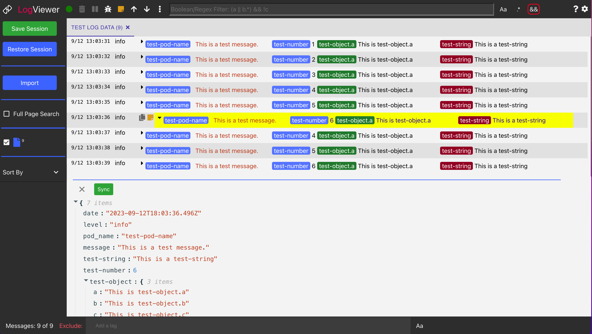
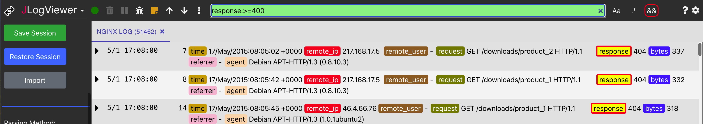
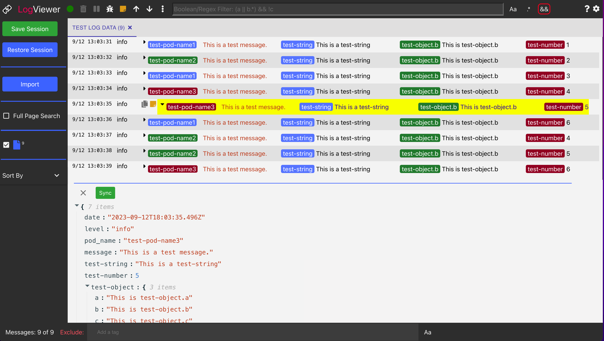
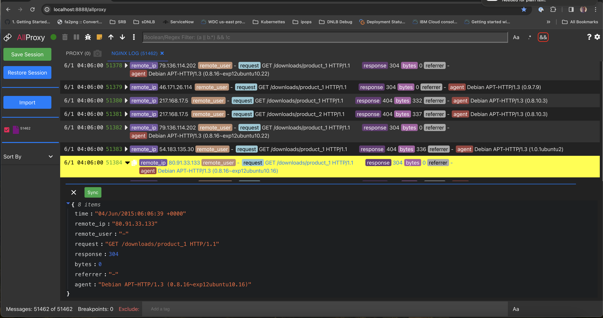
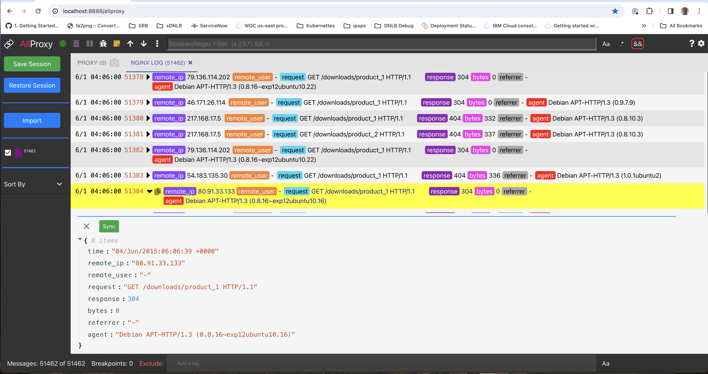
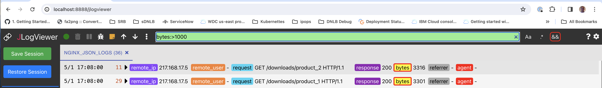
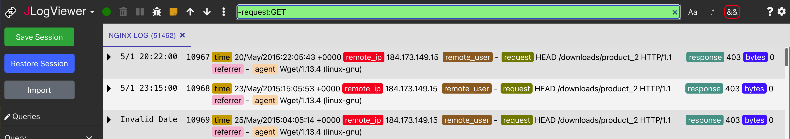
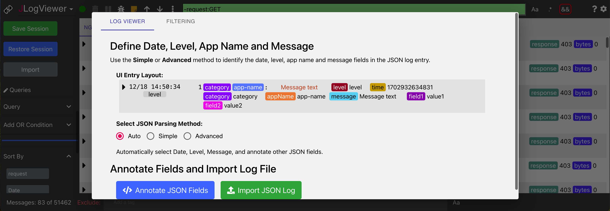

<h1 align="center" style="border-bottom: none;">jlogviewer: JSON Log Viewer</h1>
JSON Log Viewer is a UI development tool that makes JSON logs human readable.

JSON fields can be automatically or manually annotated.  Filtering makes it easy to find relevant log records.

Source Code: [github.com/allproxy/jlogviewer](https://github.com/allproxy/jlogviewer)

## Try JLogViewer Online

To try a `readonly` demo:
* Click [Try it out](https://allproxy.ddns.net/jlogviewer)
** On the left side panel click the `Restore Session` button
* From the Restore Session Modal click `Restore` to restore the `Sample NGINX JSON Log` session
* Select the `Queries` dropdown and click a query to filter the log

You may also make local configuration changes:
* Edit `Queries`
* Click the gear icon in the uppert right to change `JSON Settings`

### Install NPM Package
> 1. `npm install -g jlogviewer`
> 2. Run `jlogviewer`

### Build Package

> 1. Clone repo.
> 2. `npm install` # The production build may take a minute...
> 3. `npm start`

> Open `JSON Log Viewer` in browser;
>    * [localhost:8888/jlogviewer](http://localhost:8888/jlogviewer)

### Updating

The JSON Log Viewer uses the [allproxy](https://github.com/allproxy/allproxy) package.

To update the `allproxy` npm package run:
> **npm update**

*NOTE**:
It is recommended that `Use hardware acceleration when available` is disabled on Chrome.

## Filtering

Advanced JSON field and boolean filters can be used to find relevant log records.

Example filters:
* Filter `response:>=400` shows responses with status greater than or equal to 400
* Filter `response:403` shows 403 responses
* Filter `agent:wget` shows `wget` clients
* Filter `bytes:>1000` shows responses that are greater than 1000 bytes
* Filter `remote_ip:*` can be used to sort remote IP addresses in ascending order
* Filter `-request:GET` shows non-GET requests

**Filter `response:>=400` shows responses with status**

**Filter `response:403` shows 403 responses**

**Filter `agent:wget` shows `wget` clients**

**Filter `bytes:>1000` shows responses that are greater**

**Filter `remote_ip:*` can be used to sort remote IP addresses in ascending order**

**Filter `-request:GET` shows non-GET requests**

## Documentation

User documentation is integrated into the app.

## License

This code is licensed under the [MIT License](https://opensource.org/licenses/MIT).

