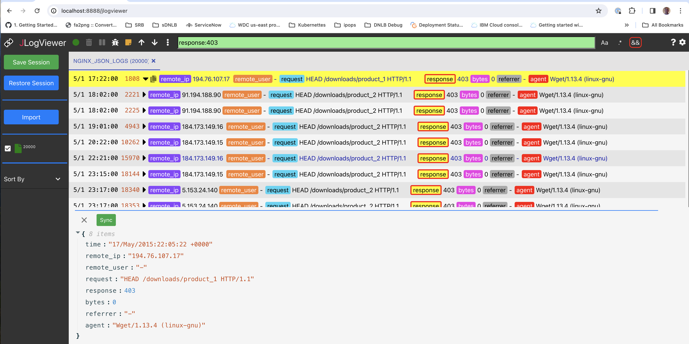
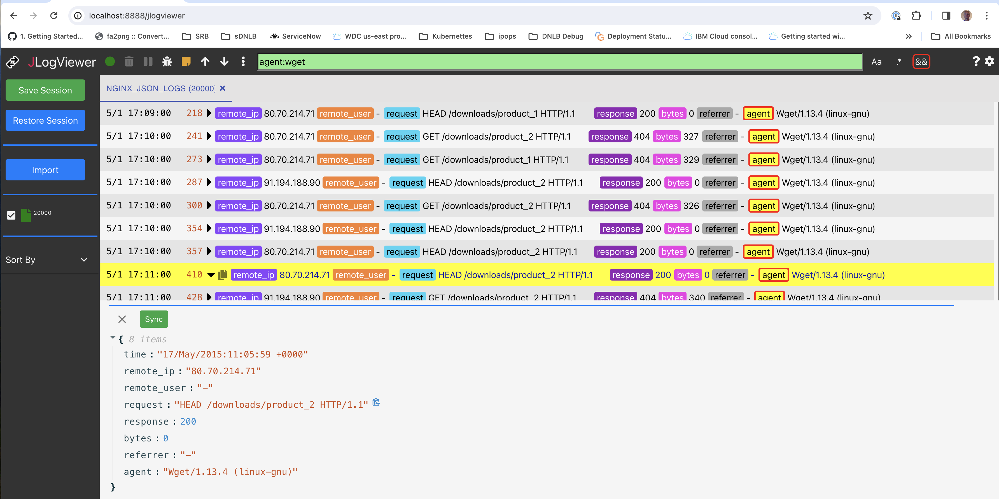

<h1 align="center" style="border-bottom: none;">jlogviewer: JSON Log Viewer</h1>
JSON Log Viewer is a UI development tool for working with structured JSON logging.
<p></p>


The web application is provided by the [allproxy](https://github.com/allproxy/allproxy) package.
<p>


## Install

**Install allproxy package**
```sh
$ npm install -g allproxy
```

**Install jlogviewer package**
```sh
$ npm install -g jlogviewer
```

To update the `allproxy` and `jlogviewer` packages re-run the `npm install -g xxx` command.

## Run in Browser
**Mac/Linux**
```sh
$ jlogviewer
```

**Windows**
```sh
$ jlogviewer_win.bat
```

**Open in browser:**
[localhost:8888/jlogviewer](http://localhost:8888/jlogviewer)

## Install AllProxy Application

The `JLogViewer` is also supported by the `AllProxy` application which can be installed [here](https://github.com/allproxy/allproxy/releases/).

## Filtering

Show responses with status greater than or equal to 400:


Show 403 responses:



Show `wget` clients:



Show responses that are greater than 1000 bytes:


Sort by remote_ip in ascending order:


Show non-GET requests:


## License

This code is licensed under the [MIT License](https://opensource.org/licenses/MIT).


